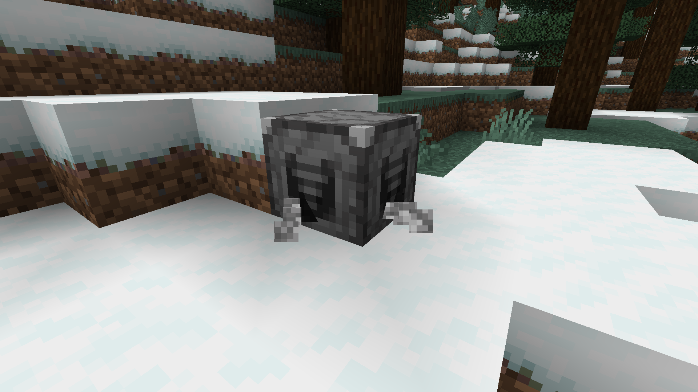

# Stone Grinder

The Stone Grinder mod is a Minecraft mod that adds a Grinder block, which includes utility recipes for building blocks. Unused building materials can be recycled into other blocks, and sand is made renewable. This mod is available for both the Fabric and Forge mod loaders. The Fabric version of this mod requires the Fabric API.

*The Grinder block in action.*

## Usage
To craft a Grinder block, surround an iron ingot in the center slot with cobblestone in a crafting table. The Grinder block is powered by fuel, similar to a furnace. Blocks take 5 seconds to grind.

## Grinding Recipes
- Stone, Stone Brick Variants, Smooth Stone -> Cobblestone
- Deepslate, Polished Deepslate, Deepslate Brick Variants -> Cobbled Deepslate
- Gilded Blackstone, Polished Blackstone Variants -> Blackstone
- Cobblestone, Mossy Cobblestone, Cobbled Deepslate, Blackstone, Andesite, Diorite, Granite, Calcite, Tuff -> Gravel
- Gravel, Sandstone Variants, Terracotta Variants (that don't grind to red sand) -> Sand
- Red Sandstone Variants, Magenta/Orange/Pink/Purple/Red Terracotta -> Red Sand
- Concrete -> Respective Concrete Powder
- Polished/Smooth Basalt -> Basalt
- Polished Andesite/Diorite/Granite -> Andesite/Diorite/Granite
- Mud Bricks -> Packed Mud
- Prismarine Bricks -> Prismarine

This mod is compatible with the [Roughly Enough Items mod](https://www.curseforge.com/minecraft/mc-mods/roughly-enough-items) for viewing grinding recipes in both the Fabric and Forge versions. The Forge version is also compatible with the [Just Enough Items mod](https://www.curseforge.com/minecraft/mc-mods/jei) for viewing grinding recipes.

## Adding Grinding Recipes
Additional grinding recipes can be added by mods or datapacks by adding recipes with the type `stonegrinder:grinding`. Default Stone Grinder recipes are in [this folder](common/src/main/resources/data/stonegrinder/recipes).

Existing Stone Grinder item tags such as `grinds_to_sand` can also be added to. Default Stone Grinder tags are in [this folder](common/src/main/resources/data/stonegrinder/tags/items).

## Authors
- NightfallClosure: Programmer, Designer
- ninjakitty844: Artist, Designer

## Translators
- pancakes0228: Chinese (Traditional, Taiwan) Translation

## Additional Notes
Please do not request support for Minecraft versions or mod loaders other than those currently supported. The mod creators will make decisions about future support.

If you are having a problem with the mod, create an issue on GitHub and describe the error. Please provide the error log if possible.